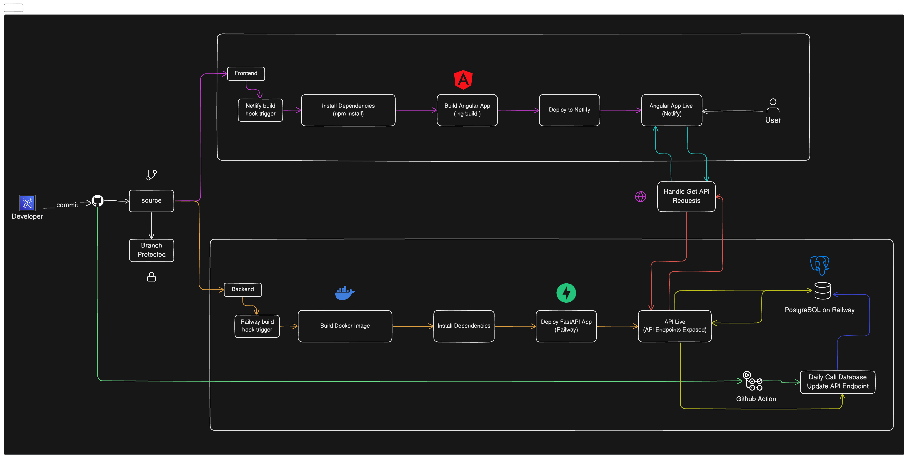

# Thesis Tracker 🚀

[](https://opensource.org/licenses/MIT)
[](https://www.python.org/downloads/)
[](https://nodejs.org/en/)
[](https://angular.io/)
[](https://fastapi.tiangolo.com/)
[](https://www.postgresql.org/docs/17/index.html)
[](https://www.docker.com/)
[](https://www.chartjs.org/)
[](https://github.com/unclecode/crawl4ai)

## Overview

Below is a visual representation of the CI/CD workflow:



**Thesis Tracker** is an open-source platform exclusively designed for the students of the University of Erlangen and Nuremberg. It simplifies the process of discovering and managing thesis opportunities across various labs within the university. Students can seamlessly explore labs of interest, track available and closed thesis topics, and gain valuable insights into the distribution of open and closed topics by each lab. With advanced search and filtering features, the platform enables students to find the perfect fit for their academic pursuits while gaining a deeper understanding of the university's diverse research landscape.

---

## Features ✨

- **📊 Lab Insights**: Gain comprehensive statistics on total labs, open/closed theses, and thesis distribution across labs.
- **🔍 Interactive Filtering**: Effortlessly search and filter by lab name, status, or keywords.
- **🌐 Environment-Aware Deployment**: Automatically adapt to local or production environments.
- **🐳 Containerized Setup**: Easily deploy with Docker for scalability and convenience.

---

## Development Technologies 🛠️

| **Technology** | **Version** | **Icon**                                                                                                          |
| -------------- | ----------- | ----------------------------------------------------------------------------------------------------------------- |
| Angular        | 18+         |           |
| Node.js        | 20+         |           |
| Python         | 3.11+       |              |
| PostgreSQL     | 17+         |  |
| Docker         | Latest      |              |
| Chart.js       | 4+          |      |
| FastAPI        | Latest      |           |

---

## Getting Started 🛠️

### Prerequisites

Ensure you have the following installed:

- **Node.js** (v20 or later)
- **Angular CLI**
- **Python** (v3.11 or later)
- **PostgreSQL** (v17 or later)
- **Docker** (for containerized deployment)
- **Git**

---

## Running Locally 🚀

### Steps

1. **Clone the Repository**

   ```bash
   https://github.com/ekram1936/Thesis-tracker.git
   cd thesis-tracker
   ```

2. **Set Up the Backend**

   - Navigate to the backend:
     ```bash
     cd backend
     python -m venv venv
     source venv/bin/activate
     pip install -r requirements.txt
     ```
   - Configure `.env` in `backend/app/environment/`:
     ```env
     DATABASE_USER=your_user
     DATABASE_PASSWORD=your_password
     DATABASE_HOST=localhost
     DATABASE_PORT=5432
     DATABASE_NAME=your_database_name
     ```
   - Start the backend server:
     ```bash
     uvicorn backend.app.main:app --reload
     ```

3. **Set Up the Frontend**

   - Navigate to the frontend:
     ```bash
     cd ../frontend
     npm install
     ```
   - Start the development server:
     ```bash
     ng serve
     ```
   - Access the app at [http://localhost:4200](http://localhost:4200).

4. **Database Setup**

   - Run PostgreSQL locally and create a new database matching `.env` configuration.

5. **Data Insertions before accessing the Web application**

   ```bash
     cd thesis-tracker
     curl -X POST http://localhost:8000/api/insert_thesis_topic

   ```

---

## Docker Deployment 🐳

### Steps

1. **Clone the Repository**

   ```bash
   https://github.com/ekram1936/Thesis-tracker.git
   cd thesis-tracker
   ```

2. **Run Containers**

   ```bash
   docker-compose up --build
   ```

3. **Access the Application**
   - Frontend: [http://localhost:4200](http://localhost:4200)
   - Backend API: [http://backend:8000](http://backend:8000)

---

## Application Workflow 📂

1. **Frontend (Angular)**:

   - Fetches lab and thesis data dynamically using API endpoints.
   - Displays charts and filters data interactively.

2. **Backend (FastAPI)**:

   - Handles RESTful API requests.
   - Manages database operations.

3. **Database (PostgreSQL)**:
   - Stores lab and thesis data.
   - Ensures efficient querying and data retrieval.

---

### Lab Scraping Checklist

| **Lab Name**                                                     | **Thesis Topic Link**                                                                                                 | **Scraping Status** |
| ---------------------------------------------------------------- | --------------------------------------------------------------------------------------------------------------------- | ------------------- |
| MAD Lab                                                          | [Visit Link](https://www.mad.tf.fau.de/teaching/studenttheses/#collapse_1)                                            | ✅ Completed        |
| PR Lab                                                           | [Visit Link](https://lme.tf.fau.de/teaching/thesis/)                                                                  | 🚀 Running          |
| LSTM Lab                                                         | [Visit Link](https://www.lstm.tf.fau.de/abschlussarbeiten/#collapse_18)                                               | ✅ Completed        |
| FAPS Lab                                                         | [Visit Link](https://www.faps.fau.de/studium/studentische-arbeiten/)                                                  | ⏳ Pending          |
| AIROB Lab                                                        | [Visit Link](https://www.airob.tf.fau.de/teaching/student-theses-and-jobs/)                                           | ⏳ Pending          |
| Chair of Automatic Control                                       | [Visit Link](https://www.ac.tf.fau.eu/teaching/4students/)                                                            | ✅ Completed        |
| ASM                                                              | [Visit Link](https://www.asm.tf.fau.de/teaching/student-projects/#collapse_0)                                         | ✅ Completed        |
| Chair of Corporate Management WiSo                               | [Visit Link](https://www.unternehmensfuehrung.rw.fau.de/studium-lehre-2/abschlussarbeiten/masterarbeiten/)            | ⏳ Pending          |
| DDS                                                              | [Visit Link](https://www.datascience.nat.fau.eu/research/groups/ouda/bachelor-and-master-theses/master-thesis/)       | ✅ Completed        |
| I-MEET                                                           | [Visit Link](https://www.i-meet.ww.uni-erlangen.de/jobs/theses/msc-theses/)                                           | ✅ Completed        |
| Chair of Information Systems I, Innovation and Value Creation    | [Visit Link](https://www.wi1.rw.fau.de/thesis-offerings/)                                                             | ✅ Completed        |
| NHR@FAU - HPC                                                    | [Visit Link](https://hpc.fau.de/teaching/theses/)                                                                     | ✅ Completed        |
| MIS Lab                                                          | [Visit Link](https://www.mis.rw.fau.de/theses-2/#thesestopics)                                                        | ⏳ Pending          |
| Department of Mathematics                                        | [Visit Link](https://en.www.math.fau.de/continuous-optimization/masters-theses-hiwi/)                                 | ⏳ Pending          |
| Chair of Computer Science 1, IT Security Infrastructures         | [Visit Link](https://univis.uni-erlangen.de/form?dsc=go&to=exa&department=1513002300)                                 | ⏳ Pending          |
| Chair of Information Technology (Communication Electronics) LIKE | [Visit Link](https://www.like.tf.fau.de/lehre/abschlussarbeiten/masterarbeiten/)                                      | ✅ Completed        |
| Chair of High Frequency Engineering LHFT                         | [Visit Link](https://www.lhft.eei.fau.de/lehr/pruefungen/freie-bachelor-masterarbeiten-forschungspraktika#collapse_1) | ✅ Completed        |

### Scraping Status Key:

- ✅ **Completed:** Successfully scraped and data validated.
- ⏳ **Pending:** Scraping not yet initiated or configured.
- 🚀 **Running:** Currently in progress.

---

## Contributing 🤝

1. **Fork the Repository**:

   - Fork this project to your GitHub account and clone it locally.

2. **Set Up Environment**:

   - Follow the [Running Locally](#running-locally) guide.

3. **Create a Branch**:

   - Use a descriptive branch name:
     ```bash
     git checkout -b feature/new-lab-integration
     ```

4. **Submit a Pull Request**:
   - Push your changes and open a pull request.
   - Include clear descriptions and screenshots (if applicable).

---

## Support 🛎️

If you face issues or have questions:

- Open a GitHub Issue.
- Contact us via email or community forums.

---

## License 📜

This project is licensed under the [MIT License](LICENSE).

---
